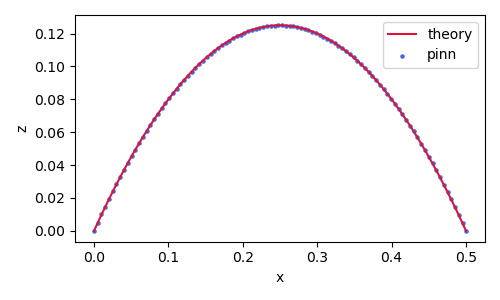

# pinn_projectile

This module implements the Physics Informed Neural Network (PINN) model for a projectile motion. The differential equation is given by

$$
\frac{d^2 \mathbf{r}}{dt} = -gz,
$$

where $\mathbf{r} = (x, z)$ is the spatial position and $g$ is the gravity acceleration. For simplicity, the spacial variables are reduced to two dimensions `x(t)` and `z(t)`, and initial positions are fixed to `x(0) = z(0) = 0`. The PINN model predicts `x(t), z(t)` for `t, v0_x, v0_z`, where `v0_x, v0_z` are initial velocities at `t=0`.

## Description

The PINN is a deep learning approach to solve partial differential equations. Well-known finite difference, volume and element methods are formulated on discrete meshes to approximate derivatives. Meanwhile, the automatic differentiation using neural networks provides differential operations directly. The PINN is the automatic differentiation based solver and has an advantage of being meshless.

The effectiveness of PINNs is validated in the following works.

* [M. Raissi, et al., Physics Informed Deep Learning (Part I): Data-driven Solutions of Nonlinear Partial Differential Equations, arXiv: 1711.10561 (2017).](https://arxiv.org/abs/1711.10561)
* [M. Raissi, et al., Physics Informed Deep Learning (Part II): Data-driven Discovery of Nonlinear Partial Differential Equations, arXiv: 1711.10566 (2017).](https://arxiv.org/abs/1711.10566)

In addition, an effective convergent optimizer is required to solve the differential equations accurately using PINNs. The stochastic gradient dicent is generally used in deep learnigs, but it only depends on the primary gradient (Jacobian). In contrast, the quasi-Newton based approach such as the limited-memory Broyden-Fletcher-Goldfarb-Shanno method for bound constraints (L-BFGS-B) incorporates the quadratic gradient (Hessian), and gives a more accurate convergence.

We implement a PINN model with the L-BFGS-B optimization for a projectile motion as the simple example.  
Scripts is given as follows.

* *lib : libraries to implement the PINN model for a projectile motion.*
    * `layer.py` : computing 1st and 2nd derivatives as a custom layer.
    * `network.py` : building a keras network model.
    * `optimizer.py` : implementing the L-BFGS-B optimization.
    * `pinn.py` : training the projectile motion in the network model.
    * `tf_silent.py` : suppressing tensorflow warnings
* `main.py` : main routine to run and test the PINN solver.

## Requirement

You need Python 3.6 and the following packages.

| package    | version (recommended) |
| -          | -      |
| matplotlib | 3.2.1  |
| numpy      | 1.18.1 |
| scipy      | 1.3.1  |
| tensorflow | 2.1.0  |

GPU acceleration is recommended in the following environments.

| package        | version (recommended) |
| -              | -     |
| cuda           | 10.1  |
| cudnn          | 7.6.5 |
| tensorflow-gpu | 2.1.0 |

## Usage

example result (image)

